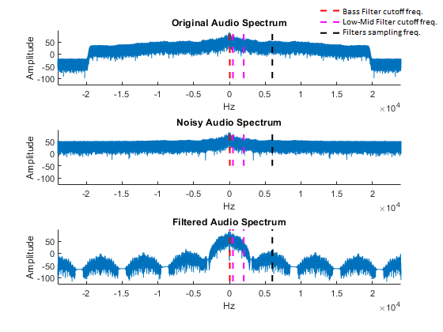

The primary goal of this project is to create a didactic voice equalizer that can effectively separate and enhance different frequency ranges of human hearing, improving a noisy signal. The equalizer is designed to operate on two channels, corresponding to Bass and Low Medium frequencies. This separation is achieved through the implementation of digital filters based on Butterworth approximations, with the numerical calculations carried out in MATLAB. To exemplify the action a song is presented with certain level of noise before and after filtering.

This guide will show you how to read an audio file, add noise for didactic purposes, design passband filters, filter the audio signal, and plot the results. The project was originally created during my college days with my colleague Guilherme Turatto for our Digital Signals Processing grade course mentored by Alexandro Barro Brito.

## Environment definition

First, we initialize MATLAB and set up the environment:
- The version of the audio to be played at the end of the computation.
- Path for the specific audio file (it can be .ogg, .mp3, etc)
- The Signal-to-noise (SNR) magnitude that will be added to the audio.

```matlab
% Choose version played:
% (-1) Noised; (0) Original; (1) Filtered
version = 1;  
% Update the path for your specific case
filename = 'C:\Users\user\Desktop\Posts/rum-and-finesse-220404.mp3';
% Added signal-to-noise ratio 
SNR = 20; 
```

## Filters specification

We can define the filters specification template as follows:

The frequency band that each filter must primarily operate

The gain of each frequency channel 

The maximum ripple (amplification) tolerated in passband

The minimum attenuation required in stopband

The size of the transition band as a fraction of the total actuated frequencies by the filter

In order to improve the tuning of these designed characteristics, we can manipulate the equations and plot the relationship between the variables:

Let 'n' be the resulting required degree, 'Amax' the maximum ripple, 'Amin' the minimum attenuation, $latex w_{s1}$ and $latex w_{s2}$ the stopping frequencies,  $latex w_{p1}$ and $latex w_{p2}$ the passing frequencies.

From the Butterworth design equations, we have that the minimum degree is:

n = ceil( $latex log_{\hat{w_{s}}}(\frac{e}{E})$ )

where: e = $latex 10^{\frac{Amin}{10}}-1$ and E = $latex 10^{\frac{Amax}{10}}-1$

From the template of passlow to passband, we have that the normalized pass frequency is:

$latex \hat{w_{s}} =  \frac{w_{s2}-w_{s1}}{w_{p2}-w_{p1}}$

Let's simplify this expression making $latex \hat{w_{s}}$ be function of the size of the transient band we defined ('tran'), as follows:

$latex w_{s1} = w_{p1}+\frac{tran}{2}\Delta w_{p}$

and $latex w_{s1} = w_{p2}-\frac{tran}{2}\Delta w_{p}$ 

where $latex \Delta w_{p} = w_{p2}-w_{p1}$ is the total work band size of the filter. Manipulating the equations, we find that for this equally spaced transient bands:

$latex \hat{w_{s}} = (1+tran)$

To improve our control of our settings, we can now plot the 'n' magnitude for multiple transients lenghts according to the relative value

Choosing as follows might lead to filters with 7th degree.

```matlab
Bass = [50 500]; % (Hz) Lower frequencies
LowMedium = [500 2000]; % (Hz) Low-Medium frequencies

GainBass = 1; % SubBass gain (0~1)
GainMedium = 1; % Bass gain (0~1)

Amax = 5; % Maximum ripple in Passband(dB)
Amin = 10; % Minimum attenuation in Stopband (dB)
tran = 0.2; % Transition band fraction (0~1)
```

To read the audio and apply the noise:

```matlab
% Reading the audio file
[audio_signal, Fs] = audioread(filename); 

% Converting stereo audio to single channel
audio_signal = (audio_signal(:,1) + audio_signal(:,2))/ max([audio_signal(:,1).'  audio_signal(:,2).'] ); 

% Add noise for didactic purposes
Signal_To_Noise_Ratio = 20*log10(SNR);
noisy_audio_signal = awgn(audio_signal, Signal_To_Noise_Ratio);
```

We can find free copyright songs as the one provided here in the link: https://pixabay.com/music/search/music%20with%20lyrics%20contest/

## Filters Calculation

Let's create our filters based on their specification:

```matlab
% Designing the Analog Passband Filter 
fprintf('\nBass Frequencies:\n');
[T1, Ts_filtros1] = PassBand_Butter(Bass, Amax, Amin, tran, GainBass);
fprintf('\nMedium Frequencies:\n');
[T2, Ts_filtros2] = PassBand_Butter(LowMedium, Amax, Amin, tran, GainMedium);
```

The template is created from the specification.

```matlab
function [ws1,wp1,wp2,ws2] = GetBandFrequencySpec(f1,f2,tran)

Hz_to_rads = @(f) 2 * pi * f;

fs1 = min(f1,f2); % Beginnig of transition band (Hz)
fs2 = max(f1,f2); % End of transition band (Hz)
fp1 = fs1+(fs2-fs1)*tran/2; % Lowest frequency on band (Hz)
fp2 = fs2-(fs2-fs1)*tran/2; % Highest frequency on band (Hz)      

wp1 = Hz_to_rads(fp1); % Lowest frequency on band (rad/s)
wp2 = Hz_to_rads(fp2); % Highest frequency on band (rad/s)  
ws1 = Hz_to_rads(fs1); % Beginnig of transition band (rad/s)
ws2 = Hz_to_rads(fs2); % End of transition band (rad/s)

end
```

The pass-band templates are normalized as lowpass filters in order to estimate the required filter order.

```matlab
function [ws_, wp_, w0] = PassBand_to_NormalizedPassLow(ws1, wp1, wp2, ws2)

w0 = sqrt(wp1*wp2);
ws_ = (ws2-ws1)/(wp2-wp1);
wp_ = 1;

end
```

The 'butter' function provided by MATLAB is useful to quickly create the filters transfer functions, once the filter order, stop and pass frequencies are provided. It recognizes the presence of one or two frequencies of each type to create low-pass or band-pass filter.

```matlab
function [T,Ts_filtros] = PassBand_Butter(Band,Amax,Amin,tran, Gain)

% Get the filter template
[ws1,wp1,wp2,ws2] = GetBandFrequencySpec(Band(1),Band(2),tran);

% Get normalized values
[ws, wp, w0] = 
PassBand_to_NormalizedPassLow(ws1, wp1, wp2, ws2);

% Estimate the filter order (n)
E = sqrt(10^(Amax/10)-1);
n = ceil(
log10( (10^(Amin/10)-1)/(E.^2))/(log10(ws)*2)
); 

% Create the analog filter
[num,den] = butter(n,[ws1,ws2],'s');

% Apply the channel gain
T = tf(num,den)*Gain;

% Define the channel sampling rate based on the highest actuated frequency 
Ts_filtros = (2*pi)/(ws2*3);

fprintf('Passband: %.1f < f < %.1f Hz\n' ,(wp1)/(2*pi), (wp2)/(2*pi));

fprintf('Stopbands: %.1f < f, f > %.1f Hz\n', (ws1)/(2*pi), (ws2)/(2*pi));

end 
```

The transfer functions are calculated using Butterworth method due to its monotonic and predictable amplitude response in the passband. For instance, while filters like Chebyshev can achieve the same attenuation with lower degree, this result comes at the cost of a higher passband oscillation.

We can visualize the resulting filters in the Bode diagram:


The original sampling rate of 48k Hz could lead the filtered signal to oversampling if applied, since the higher work frequency is designed to be 2k Hz (24 times lower). The new sampling rate for the digital filters is determined so that they provide enough sampling of the desired actuation band. Regarding the Nyquist–Shannon theorem, a sampling rate was designed as five times the highest stopband frequency of each filter.

The multi-sampling complexity can be avoided using the same rate for both filters if there is a common feasible value. In this context, the maximum sampling rate is feasible for both filter bands. This value is then adjusted to be an integer divisor of the original audio sampling rate, simplifying the resampling step in possible embedded implementations.


```matlab
% Estimating the new sampling time for the filtering as multiple of Ts

Ts_filtros = Ts*floor(min([Ts_filtros1 Ts_filtros2])/Ts);

Fs_filtros = 1/Ts_filtros;

fprintf('\nOriginal signal sampling time: %.3f us\n', Ts*10^6);

fprintf('\nFiltering sampling time: %.3f us\n', Ts_filtros*10^6);
```

The transferfunctions are then denormalized and transformed from analog to digital using common sampling rate.

```matlab
% Discretinzing the analog filters
T1z = c2d(T1, Ts_filtros, 'zoh');
T2z = c2d(T2, Ts_filtros, 'zoh');
```


The filtered responses are computed with the MATLAB function 'filter' regarding a resampled version of the original audio signal that matches the channel's common sampling rate.

```matlab
% Resampling the original signal to match the filtersaudio_signal_resampled = ResambleSignal(noisy_audio_signal, Fs, Fs_filtros);

% Filter the signal
filter_response_1 = filter(T1z.Numerator{1}, T1z.Denominator{1}, audio_signal_resampled);

filter_response_2 = filter(T2z.Numerator{1}, T2z.Denominator{1}, audio_signal_resampled);

function resambled = ResambleSignal(signal, originalFs,desiredFs)
    [p,q] = rat(desiredFs / originalFs);
    resambled = resample(signal,p,q);
end 
```

The filtered channels are then summed and returned to the original rate so that the audio does not suffer from pitch shifting due to the sampling. Also, the amplitude was normalized regarding the original, so that the channel'ss gains sum do not surpass the unitary magnitude.

```matlab
% Combining filtered channels
signal_out = filter_response_1 + filter_response_2;

% Returning to original audio level
signal_out = (signal_out / max(signal_out)) * max(noisy_audio_signal);

% Resampling the output to match the original sampling
signal_out_resampled = ResambleSignal(signal_out, Fs_filtros, Fs);
```

Finally, the filtered version is playable.

```matlab
% Play audios according to selected audio 'version'
if version > 0
    sound(signal_out_resampled, Fs);
elseif version < 0
    sound(noisy_audio_signal, Fs);
else
    sound(audio_signal, Fs);
end
```

We can plot the signal's magnitude variations over time, offering a comprehensive visual representation of the various stages of the audio processing pipeline.

While the plot of audio magnitudes offers a visual comparison of signals, the differences between these signals can be subtle and may not be easily discernible to the human eye. This is where the Fourier Transform comes into play, providing a powerful tool to analyze and understand the frequency components of these signals in greater detail.

The red and pink lines delimiter the work frequencies of the filters and the black line the sampling rate. The original audio spectrum has smooth amplitude until a huge drop around 24k Hz, indicating a clean signal with distinct frequency components as expected by a well recorded song sampled with 48k Hz.

The noisy version does not have the drop since there was white noise added, convering higher frequency bands. These frequencies represent the hiss sound (familiar to those who used old TVs with static).

The filtered spectrum exemplify the well-know phenomenon of replications along the frequency spectrum, showing the importance of the Nyquist–Shannon theorem. Some peaks and troughs still show up, suggesting the presence of some remaining noise or artifacts introduced by the filtering process. However, the filtering makes the channel's frequency components more prominent by removing unnecessary/undesired frequencies, restoring some of the audio signal's clarity.

I encourage everyone to download play the audios provided here.


